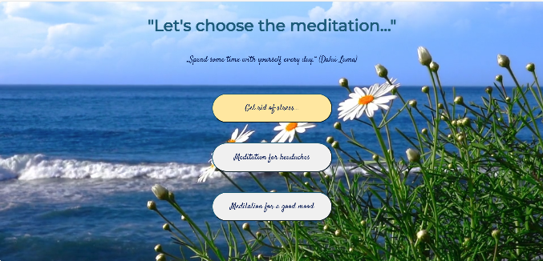

Meditation App

Hello! This is my simple meditation web app where you can choose from three different meditations to help you relax and feel better:

Meditation to get rid of stress

Meditation for headaches

Meditation for a good mood

## 📸 DEMO:

...
## 🛠️ Technologies Used

I used simple and modern web technologies:

HTML5 and CSS3 for structure and style

JavaScript to handle the timer functionality

Background videos and audio files to create a relaxing atmosphere

Google Fonts to make the typography nicer

## 💡  How to Use

Download or clone the project to your computer:
git clone https://github.com/yuliatik/meditation-app.git

Open the index.html file in any web browser.

Click any meditation button to start relaxing!

📌 License This project is open-source and available under the MIT License.

This project was created as part of a learning exercise and is intended for educational use only.

Feel free to ask questions or suggest improvements!
